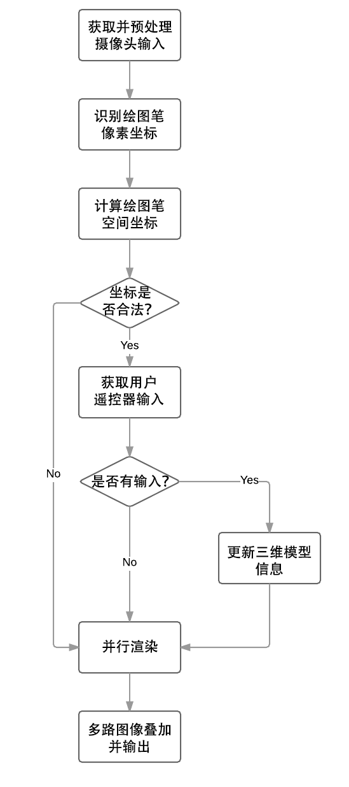
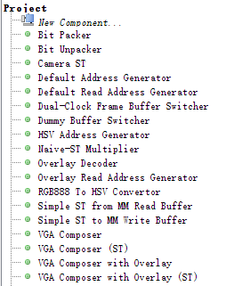

## 设计概述

### 设计意图

在3D技术逐渐走入日常生活的现在，三维建模的需求也变得日益庞大。对于模型设计师来说，如果能像在现实中建造模型一样设计三维模型，无疑能简化模型设计的过程。目前一些知名厂商已经提出了基于虚拟现实或增强现实眼镜的通用解决方案，比如微软的HoloLens和Oculus公司的Oculus Rift。但这类解决方案因为其通用性、便携性，以及对硬件配置的极高要求，导致其使用成本高昂，也就很难推广开来。

而我们希望通过设计专门的硬件系统，以提供低成本和高效的解决方案。具体地说，我们的系统包括一套显示器与摄像头结合的显示设备，以及一支专用的绘制笔。用户利用我们的系统，可以使用绘制笔在空气中绘制3D模型，摄像头捕捉之后可以显示在显示屏上，看上去就好像是在现实中进行三维建模一样。

### 适用范围及针对用户群

本设计针对需要进行三维建模的模型设计师，可以改变传统的建模流程，允许模型设计师使用更加直观、符合直觉的设计方法。另外，由于整套系统造价低廉，可以降低三维建模的入门门槛，因此也可以应用于各院校和公司的建模教学和训练中。

另外，本设计具有较强的可扩展性。如果后期再进行一些PC端的上位机通信程序的开发，则可以将建立的模型导出成传统设计软件所支持的格式，满足实际中的应用。

### 选用Altera器件的原因

我们选用Terasic DE2i-150开发板作为开发平台，原因有三：

第一，该开发板性能强劲，可拓展性强，便于开发。开发板的FPGA核心为Altera Cyclone IV EP4CGX150DF31C，具有多达15万个逻辑单元。开发板上还有丰富的外部接口，以及多种大容量的存储设备。这些设备也都有详尽的配套使用说明书与规格文档，给我们的开发带来了极大的便利。

第二，我们的系统中需要用到一些算法，如识别绘制笔的算法，以及渲染算法等。这些算法使用传统软件开发的指令式编程方法实现起来较为简单，但使用硬件编程方法则难以实现。而Altera提供的Nios II软核可以在FPGA内部综合出CPU，从而允许我们按照软件编程方法实现算法，极大简化了开发流程。

第三，该开发板价格低廉，非常符合我们的设计意图。

## 功能描述

本设计实现了一个基于FPGA硬件的三维建模辅助系统。系统通过双摄像头确定绘制笔在空间中的坐标，并通过与用户交互进行空间中三维模型的绘制，再将渲染出来的模型叠加在摄像头的图像上，就像是在现实中真正制作了一个模型一样。

详细地说，本设计实现了以下四个功能：

- **绘制笔的识别：**
  我们的绘制笔具有特定的颜色，可以将其与常见的背景区分开。因此我们寻找图像中具有类似绘制笔颜色的像素块，并以面积最大的像素块作为绘制笔的位置。
  识别的算法如下：首先将摄像头的RGB565输入信号转换为HSV格式，并根据设定的阈值进行二值化。接着对二值化之后的图像进行两次腐蚀及膨胀处理，以去掉噪点并填充内部空洞。最后执行floodfill算法寻找最大的连通块。
  至于具体实现，我们使用硬件实现了HSV转换模块，腐蚀、膨胀以及floodfill算法则使用Nios II CPU实现。为了加速算法，我们使用位运算完成腐蚀和膨胀，并结合floodfill与扫描线方法以减少内存开销。
- **绘制笔的定位：**
  综合两个摄像头画面中绘制笔的平面坐标，可以计算出绘制笔在三维空间中的坐标。我们先离线确定了摄像头的内部参数（如焦距等），便可以使用公式计算出绘制笔相对于摄像头的位置。
- **三维模型的建立：**
  用户使用一只绘制笔确定模型关键点的三维坐标，同时使用一个红外线遥控器发送指令。用户可以通过遥控器更改物体颜色，选择绘制物体的类别，确定关键点位置等。比如说，用户想要绘制一个球体，则按下遥控器上对应按键确定球心的坐标为当前绘制笔的坐标，然后再确定另一个点为球面上的点。在用户移动绘制笔的过程中，屏幕上会即时显示当前绘制物体的轮廓线。
- **三维图像的渲染：**
  用户在绘制了一个物体后，物体会按照用户选定的颜色被渲染。我们使用了三枚Nios II CPU，使用扫描线+深度缓存的方法进行并行渲染。

## 性能参数

### 系统参数

FPGA芯片型号：Altera Cyclone IV EP4CGX150DF31C

Qsys系统时钟频率：100MHz

SDRAM时钟频率：100MHz，-3ns相位偏移

VGA参数：640×480@60Hz

有效识别距离：x轴：±40cm，y轴：±40cm，z轴：0~200cm

### 性能分析

- **识别部分：**摄像头输入数据为30帧/s；HSV转换及二值化模块使用硬件实现，可以进行流水线式运算；腐蚀、膨胀及floodfill使用CPU实现，处理速度约能达到10帧/s。
- **渲染部分：**在绘制新物体时，需要首先更新深度缓存并计算法向量，

## 设计结构

### 总体架构

 系统的结构示意图如下：

系统可以主要分为三个部分：

- **识别部分：**负责摄像头输入图像的采集、预处理以及绘制笔识别；
- **控制与渲染部分：**负责三维图像渲染以及整体调度；
- **存储与输出部分：**负责与外部存储设备进行沟通，以及图像的叠加与输出。

系统一共使用了6枚Nios II软核CPU，每个CPU执行的任务如下：

- CPU 0和1负责识别绘制笔的坐标；
- CPU 2负责整体调度以及GUI的绘制；
- CPU 3至5负责三维图像的并行渲染。

所有部件均作为Qsys组件存在，不同组件之间通过Avalon-MM或Avalon-ST协议通讯。为了实现一些复杂功能并尽可能挖掘性能，我们使用了许多自定义的部件。

### 数据传输与存储

本设计的输入主要来自两个外接摄像头。摄像头的输入被分为两路分开处理：

- 两个摄像头的输入按照Avalon-ST协议进行编码，通过自定义的RGB565至HSV转换模块及二值化模块处理后，转换为Avalon-MM协议，存入两块Onchip Memory中。两枚负责识别的CPU会分别读取这两块内存中的信息并识别绘制笔的坐标。
- 右侧摄像头的输入按照Avalon-ST协议进行编码后，直接被转换为Avalon-MM协议，作为显示画面存储。

存储方面，本设计中使用了开发板上的SDRAM和SSRAM两块存储设备。

SDRAM主要作为显示缓存使用。开发板上两块SDRAM共同工作，组成了32位字宽。该SDRAM有4个库（bank），我们使用了其中三个，分别用于摄像头图像、渲染图像，以及渲染深度缓存的存储。为了防止输出图像出现撕裂现象，图像的存储均使用了三缓存机制。

SDRAM需要处理多路输入和输出。为了提高效率，充分利用SDRAM连续读写功能，SDRAM的每路输入输出都经过了FIFO缓存，并均进行长度为64的连续访问。由于我们使用了Altera提供的SDRAM Controller IP，这一IP将SDRAM包装成了一个Avalon-MM Slave，但不支持burst。为了防止仲裁机制将正在进行的连续读写打断，我们使用了Avalon-MM Master接口中的lock信号，以确保Master可以保持对Slave的控制。

SSRAM则用于存储GUI叠加层的图像。这一设计主要是为了缓解SDRAM的读写压力，而且GUI层的颜色种类少，可以对颜色进行编码后压缩存储，以适应SSRAM的空间限制。GUI层同样使用了三缓存机制，并使用双FIFO实现连续访问。

输出方面，我们需要叠加摄像头、渲染和GUI三层图像。为此，我们设计了VGA Composer自定义模块，包含三个Avalon-ST Sink，分别对应三路数据。VGA Composer根据透明度信息混合三层图像，并配合VGA控制信号输出。

### 基本流程

整体逻辑的基本流程可以用下图描述：

## 设计方法

### 硬件设计

硬件设计全部在Qsys中完成。在开发过程中，我们采用了敏捷开发的方法，逐一实现各功能和模块，并整合进整体系统中。我们采用了如下的设计理念：尽可能将功能拆分成相互解耦合的小模块。为此我们设计并实现了许多自定义组件，如下图所示：

下图中为从摄像头获取图像并存入SDRAM的模块构成的子系统。camera_st_0为摄像头控制模块，将获取到的摄像头图像转换为Avalon-ST协议，提供给vid_write_buffer_0。vid_write_buffer_0是一个跨时域的双FIFO缓存，并实现了从Avalon-ST到Avalon-MM协议的转换，其对外暴露了一个Avalon-MM Master，并在上层系统中连向了SDRAM Controller的MM Slave。此外，vid_write_buffer_0还有一个addr_gen的conduit接口，需要由地址生成模块default_addr_gen_0提供MM Master的写入地址。default_addr_gen_0顾名思义，提供SDRAM使用的默认的行列地址，此外还有一个conduit_buffer的conduit接口，在上层系统中连接到三缓存控制器。

之所以使用这种看似繁琐而复杂的方法设计许多小部件，而非用一个大组件囊括所有功能，是为了提高组件的可复用性和可拓展性。比如说，我们还需要将摄像头的图像转换为HSV格式后存入Onchip Memory中，我们可以重复利用这些部件构建一个新的子系统，如下图所示。这里我们在上面子系统的基础上加入了convert_hsv_0和bitpacker_0两个部件，并用hsv_addr_gen_0替换了default_addr_gen_0。convert_hsv_0实现了RGB到HSV的转换以及二值化，其输出为1位字宽的Avalon-ST信号。bitpacker_0接收这一信号，并将其打包为8位字宽的信号，以便存入Onchip Memory中。vid_write_buffer_0向上层系统暴露的Avalon-MM Master接口连接到了Onchip Memory的MM Slave，而hsv_addr_gen_0则是针对Onchip Memory的地址生成部件。

所有自定义部件均通过ModelSim进行仿真，在一定程度上保证了可靠性和鲁棒性。下图为ModelSim仿真的截图。由于部件大多使用了Avalon-MM或Avalon-ST协议，信号需要遵守协议规范，因此仿真时使用了Altera提供的BFM（Bus Functional Model）进行测试。这一模块可以模拟一个Avalon总线中的模块（MM Master/Slave或ST Source/Sink等），并对外暴露控制的API。当我们对一个Avalon-MM Master进行仿真时，则使用Avalon-MM Slave BFM接受Master发起的传输指令，并判断是否符合规范。

### 外部设备

本设计中使用到了多种类的外部设备，包括两个摄像头、SDRAM以及SSRAM。

我们使用的摄像头为OmniVision OV7670。这款摄像头以高性价比和高自定义程度著名，是许多低成本硬件系统的首选。两个摄像头均通过GPIO针脚连接到开发板。这款摄像头使用SCCB通讯协议实现对内部寄存器的配置。然而数据手册中将许多寄存器标为保留，网上给出的各种寄存器配置也各不相同。最后我们综合网上给出的若干份配置，经过许多次尝试之后才将摄像头配置成输出RGB565格式的图像。

SDRAM和SSRAM则集成在了开发板上。我们在一开始遇到了许多显示上的问题，包括画面偏移、缺列等，后来发现都是由SDRAM相关的时序问题导致的。经过探索我们发现，需要将SDRAM的时钟加上-3ns的相位偏移。之后我们将SDRAM的时钟及相关输入输出针脚加入SDC文件中，顺利通过了TimeQuest的时序分析。

### 算法设计

识别与渲染算法是本设计的核心之一，也是本设计中的性能瓶颈。因此我们针对使用场景进行了专门设计，尽可能优化算法效率。

#### 识别算法

识别算法包括两个部分：绘制笔在图像中的识别，以及绘制笔在空间中的定位。

识别部分我们选择直接在图中搜寻与绘制笔颜色相近的像素构成的连通块。要完成这一任务，首先我们需要设置“颜色相近”的阈值。为了更方便地区分颜色，我们将图像转换为了HSV色彩格式。HSV色彩格式的三个分量H、S、V分别是色相、饱和度、明度，因此可以减少光照条件变化给颜色识别带来的麻烦。

确定阈值后，我们便可以对图像进行二值化。二值化之后的图像非黑即白，白色为“颜色相近”的像素。然而，图像含有较多噪点和内部空洞，因此我们使用腐蚀和膨胀运算来降噪并填补空洞。所谓腐蚀，即为以一个像素周围九个像素中的最小值替换这个像素的值；膨胀则为以最大值替换。在二值图像上则等同于逻辑与和逻辑或，因此可以用位运算优化。

剩余需要做的就是找到最大的白色连通块了。一个常用的算法就是floodfill算法，其思路非常简单，从一个白色像素出发，向四连通的白色像素拓展，知道遍历完整个连通块。然而片上内存资源有限，无法直接使用深度或者广度优先搜索。因此我们将基于广度优先搜索的floodfill算法与扫描线算法结合，在队列中存储一行中连续一段白色像素的左右端点，向上下相邻行拓展。这一算法所需的最长队列长度不超过图像宽度的两倍。

在实现识别部分的算法之前，我们先使用OpenCV开源框架实现了一个简单的Python程序，然后逐渐将其翻译成了C。借助这一框架，我们无需在硬件上进行调试，也可以快速找出算法中出错的部分，节省了宝贵的调试时间。

识别部分之后就是定位部分。我们已知绘制笔在两个摄像头中的像素坐标，可以参考下图推导其空间坐标的公式。图中$f​$为摄像头焦距，$x^l​$和$x^r​$分别为两摄像头中的横坐标，$c_x^{left}​$和$c_x^{right}​$为两个摄像头光轴与成像平面相交点对应的横坐标，$T​$为摄像头间距，$Z​$则为绘制笔到摄像头的距离。易知此图中$Z=Tf/\left((x^l-c_x^{left})-(x^r-c_x^{right})\right)​$。

而实际上，两个摄像头在两个方向上的的焦距均不等，因此实际使用的公式如下：

$Z=T/\left((x_l-c_x^{left})/f_x^{left}-(x_r-c_x^{right})/f_x^{right}\right)$

$X=Z\left(x^r-c_x^{left}\right)/f_x^{left}$

$Y=Z\left(y^r-c_y^{left}\right)/f_y^{left}$

绘制笔的坐标即为$(X,Y,Z)$。

焦距等摄像头内部参数可以通过离线的方法测定。我们将摄像头的图像借助Nios II输出到计算机的终端上，并调用OpenCV提供的函数进行测定即可。

#### 渲染算法

渲染算法使用的是传统的深度缓存方法。这一方法存储每个像素距离视点最近的物体及其距离，以避免每次重新计算。渲染时，只需计算视线与每个像素记录的最近物体的交即可。

在添加一个物体时，由于我们在定位时已经得知了物体的每个关键点投影到屏幕的坐标，我们便能知道物体在屏幕上的轮廓，从而避免访问轮廓以外的像素。对轮廓内的所有像素，判断新的物体是否比原最近物体更近，并更新深度缓存。

为了简化计算，渲染并未采用具有物理真实感的渲染模型。像素的光照强度直接由法向量的方向求得，因此立方体同一个面的颜色相同。另一方面，由于浮点运算速度较慢，在不损失计算精度的前提下，我们在尽可能多的地方使用整数运算取代了浮点运算。

## 设计特点

本设计的独特之处如下：

1. **应用广泛、可拓展性强：**本设计虽然是CAD系统，但本质上也可以视为一款简化的AR设备，可拓展性强，而且具有广阔的应用前景。
2. **快速的数据存取**：系统需要能实时处理双摄像头输入的图像信息，还需要存储渲染的中间信息，对于数据存储和处理的要求都相当高。我们使用了开发板上的外部SDRAM和SSRAM作为VGA的输出显存，并针对VGA输出和渲染算法的特点设计了基于Avalon-MM协议的双FIFO缓存，以充分利用连续访问的特性，加快读写速率。
3. **极高的实时性**：系统对实时性的要求非常高。出于效率的考虑，我们将一些关键的部件使用硬件实现，包括HSV转换、三缓存控制、图层叠加等。另外，我们用流水线替换了一些耗时的组合逻辑，提高了系统整体的时钟频率。
4. **严格的时序**：系统结构较为复杂，对时序要求严格。不同的模块的输入输出时钟不同，在许多地方插入了跨时域逻辑。在加入时钟限制后，可以通过TimeQuest时序分析。
5. **可靠、鲁棒的系统：**所有自定义部件均经过ModelSim仿真测试，在一定程度上保证了可靠性。部件在针对使用场景特化时，也权衡了对其鲁棒性的影响，最终选择了两边兼顾的设计方法。
6. **基于Nios II的算法开发**：绘制笔的定位与三维渲染使用Nios II软核实现，较之于硬件实现，这种实现更为简便和直观。

## 总结

从确定选题到最终完成开发，历时将近四个月。通过这四个月的努力，我们将当初的想法变成了现实。虽然因为时间仓促，有些功能没有来得及实现，也有一些限于资源问题无法实现的功能，也算是有一些遗憾，也还有改进的空间。

本次大赛让我们对于硬件开发有了更深刻的体会，也让我们充分熟悉了Altera FPGA器件的开发环境。Altera提供的Quartus II以及Qsys软件功能强大，其内置的各类IP也为我们的开发带来了极大的便利，而且具有非常详细的文档和教程。Terasic提供的开发板也便于使用，而且功能丰富，可以充分满足我们的需求。

最后，感谢Altera公司和Terasic公司为我们提供了参加本次比赛的机会。